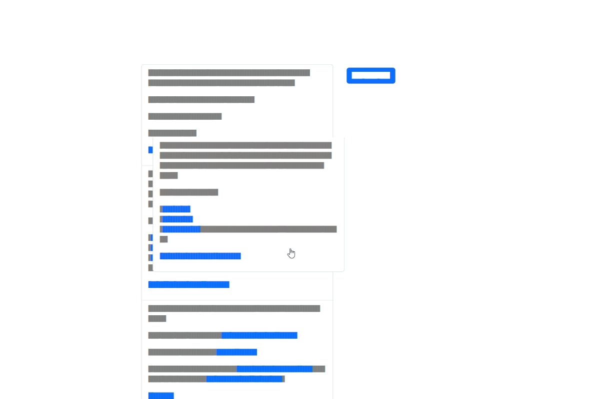

# Pinned post organizer



Organize your pinned Mastodon posts with a simple drag and drop interface.

## Development

This site is made with [11ty](https://www.11ty.dev/). It also uses the [auth-server](https://github.com/stefanbohacek/auth-server) project to handle authorization.

```sh
npm install
npm run dev
```
